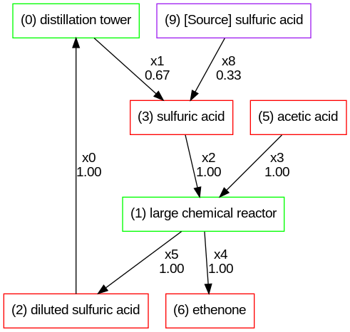
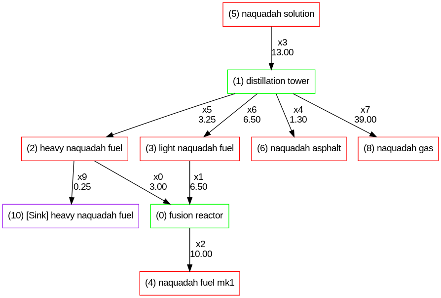

# Steps Towards General GTNH Flow Solving

Machine flow problems in GTNH can be represented as a linear system of equations. See the following problem construction, where each edge in the flowchart represents a variable in the linear system of equations:

<table>
<td>


</td>
<td>

```
SUBJECT TO
_C1: 0.0625 x0 - x1 = 0

_C2: 781.25 x0 - x2 = 0

_C3: 8 x3 - x4 = 0

_C4: - x0 + x4 + x5 - x6 = 0

_C5: x0 = 0.896
```

</td>
</table>

Once the edge values are constructed, the machine counts can be calculated directly from them. For example, if the balanced flowchart needs to output 1000 oxygen/s, and the provider machine produces 500 oxygen/s, then you need 2 of that provider machine.

This works excellently for "simple" scenarios. However, it breaks in two situations:

1. If there are non-fully recycling loops in the machine flow, either you need more initial product, or you need to add more recycling product input. An example below:

<table>
<td>



</td>
<td>

```
_C1: 0.666666666667 x0 - x1 = 0

_C2: x2 - x4 = 0

_C3: x2 - x5 = 0

_C4: x3 - x4 = 0

_C5: x3 - x5 = 0

_C6: - x0 + x5 + x6 - x7 = 0

_C7: x1 - x2 + x8 - x9 = 0

_C8: x0 = 1
```

</td>
</table>

(In this case I chose additional sulfuric acid. I could have also added additional diluted sulfuric acid.)

2. If "parallel" output ratios of a machine are used later in different ratios, then either excess will need to be discarded, or more product added. Example below with naqfuel:

<table>
<td>



</td>
<td>

```
_C1: 3.33333333333 x0 - x2 = 0

_C2: 1.53846153846 x1 - x2 = 0

_C3: 0.1 x3 - x4 = 0

_C4: 0.25 x3 - x5 = 0

_C5: 0.5 x3 - x6 = 0

_C6: 3 x3 - x7 = 0

_C7: - x0 + x5 + x8 - x9 = 0

_C8: - x1 + x10 - x11 + x6 = 0

_C9: x2 = 10
```

</td>
</table>

As you can see, heavy naquadah is produced in excess by the distillation tower, so it needs to be discarded. (Another option would have been to source additional light naquadah fuel from elsewhere.)

As a result, general machine flows in GTNH cannot be represented just as a linear system of equations. However, it is unclear the exact complexity level needed above this.

We need some way to programmatically insert source and sink nodes based on the scenario at hand. We cannot simply observe the chart afterwards and say "there is an excess" as this will not count as a valid solution to the linear system of equations and therefore never be found by the original program.

One solution is to extend the linear system of equations into a linear program, which allows for specifying an objective function. My first approach at solving this problem was:

1. Insert Source and Sink nodes for every ingredient that is not already a source/sink (ie, IngredientNodes with >0 inputs and >0 outputs).
2. Add a minimized objective function equal to the quantity of ingredient pulled from source/sink - this way, pulling from source/sink is disincentivized unless it is necessary to find a feasible solution to the linear system.

This worked as a first approximation, but then some problems had non-ideal solution behavior:

1. Set user chosen variable (eg 10 naqfuel mk1/s)
2. Get both input ingredients for the parent machine from source
3. Set all other edge variables to 0, which solves the remainder of the constraint equations

Why was it performing this way? Well, something higher in the tree required a greater quantity of product pulled from source. If the graph was solved "correctly", then it would have pulled 1000 of product B from source, but it could instead solve it by pulling 2 of product A from source and setting everything to 0. 2 < 1000, so this is the minimizing solution.

Ok, well clearly we are missing information in our objective function. It is desirable to have flow between all non source/sink nodes, and the more flow the better. The program should be penalized for solutions which have zero flow between nodes. Then our minimizing objective function can look like:

$$-\sum{c_1 * edge_{machine}} + \sum{c_2 * edge_{source/sink}}$$

This seems fine, until you realize that "the more flow the better for machine edges" means any processes that were previously balanced recycling can be pushed up to infinite flow by simply adding more source product. Going back to our sulfuric acid loop example:


If you feed 1 extra sulfuric acid from source instead, now the system puts in 0.67 sulfuric acid and gets out 1.67 sulfuric acid. Now the objective function value can go to negative infinity, and the solution is unbounded.

You can attempt to "mitigate" the problem by setting the penalty for pulling from source/sink to a very high number. Specifically, $\dfrac{c_2}{c_1} >> 1$. This sort of works, but is fragile to a highly positive loop (eg where inputting 1 extra from source creates 100000 extra product - which is possible with certain bio lab setups.)

It also doesn't solve platline. The reason for this is because our original problem with "sensitive" solutions remains. Now that $\dfrac{c_2}{c_1} >> 1$, the $\sum{c_2 * edge_{source/sink}}$ dominates the rest of the expression, unreasonable 2 < 1000 solutions are prioritized again.

Ok, so what we should really be prioritizing is not the numerical quantity of source/sink ingredient flow (it should always be the amount needed for solving the chart), but instead minimizing the number of source/sink flow nodes added to the pre-existing chart. Then the solution will be the one that minimizes pulling from external sources. Unfortunately, this means we can no longer calculate the source/sink quantities directly in the linear program, as there is no way to represent a "boolean" switch of on/off in the required format of the objective function:

$$\sum{c_x * v_x}$$

One way would be to make multiple graphs - one for each possible combination of source/sink nodes, then linear solve each of them. Then pick the feasible solution with the least zero flow edges, as this is probably the correct solution to the graph problem. This sounds good, until you realize that creating each combination of source/sink nodes is extremely computationally infeasible. The number of these "non-source-sink" IngredientNodes that require source/sink node checking in just a limited subset of platline is 14. The number of combinations that need to be checked is:

$$\sum_{r=1}^{14}{ _{n}c_{r}} = 16383$$

Ok, that's not good. And it scales exponentially for sure. We need to support platline, naqline, and stargate. Maybe we can represent it by making a Mixed Integer Linear Problem (MILP), and creating a new Integer-only variable for whether a source/sink is on? This too should work - but the complexity scaling for MILPs is NP-hard. The worst case scenario for a MILP is doing the same as our combinations method, so it doesn't save us.

So - the remaining question. Is it salvageable to treat GTNH machine flow problems as a linear program? Or are we stuck with exponential time complexity to get fully accurate solutions?