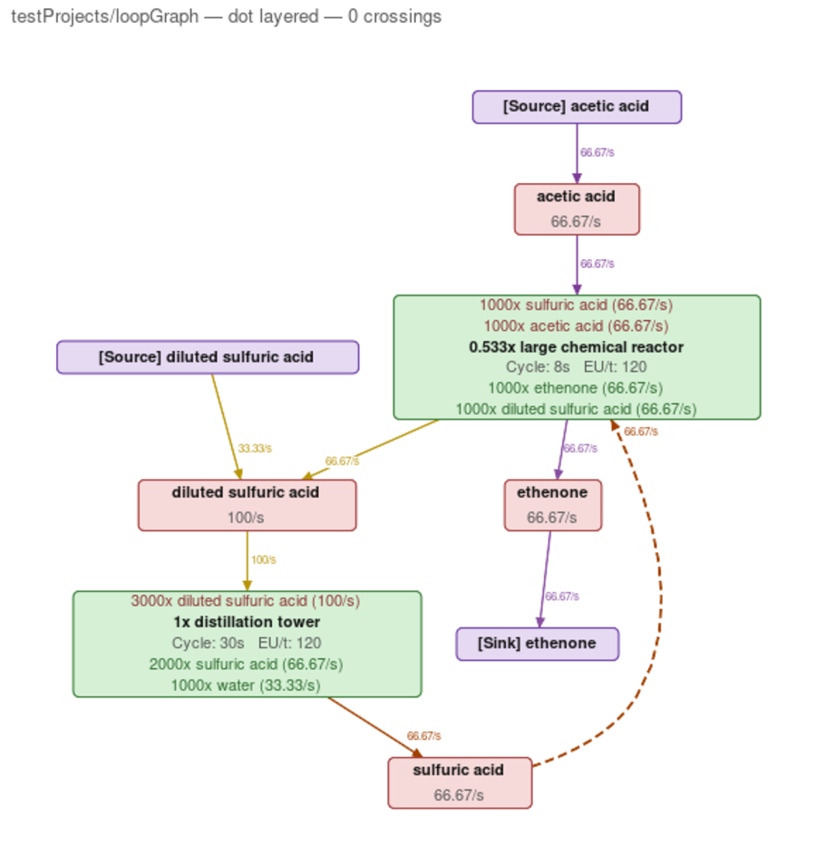
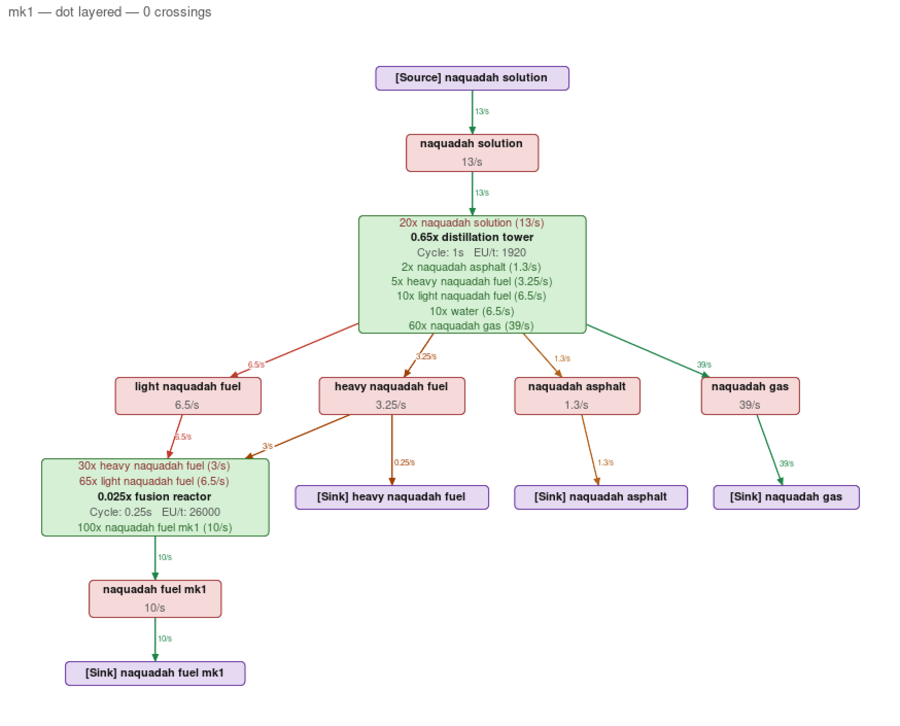
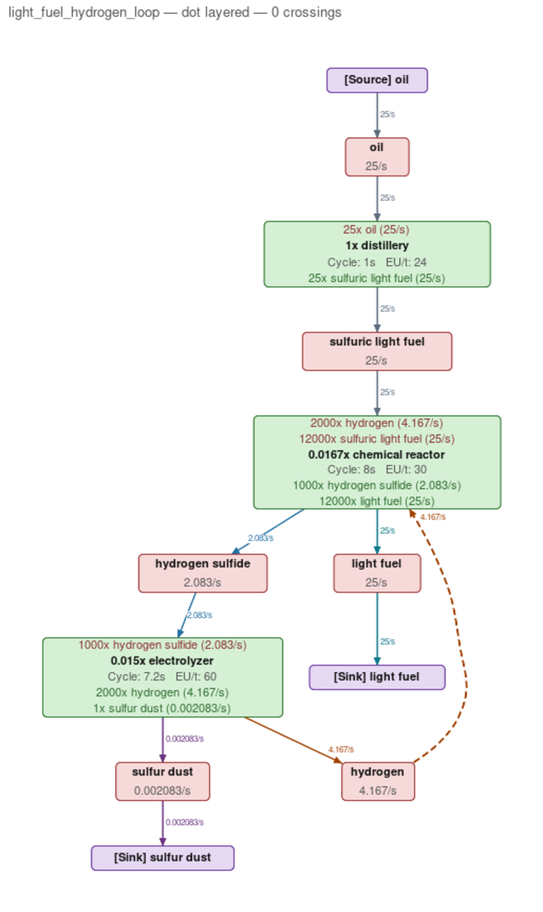
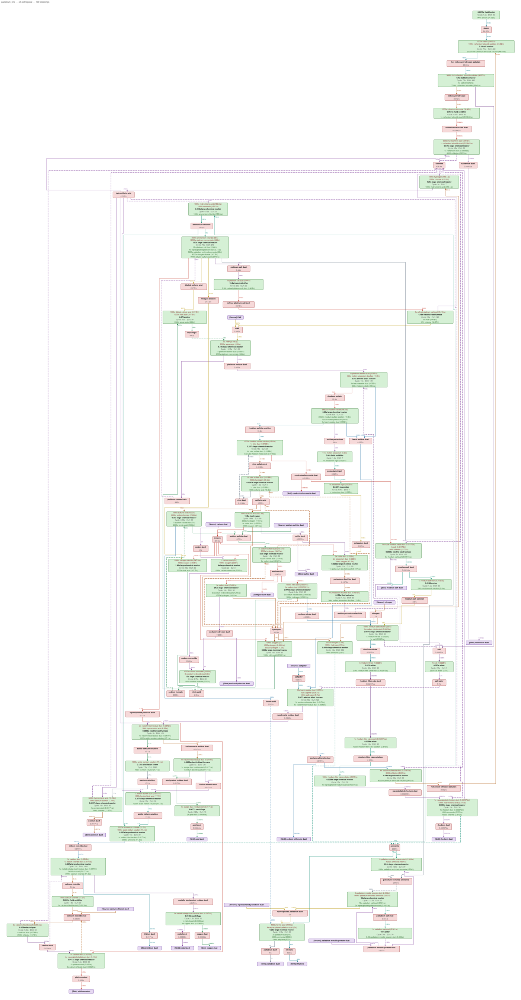
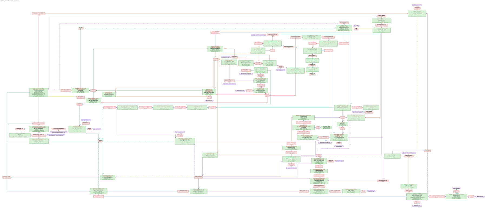
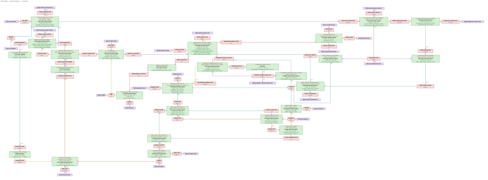

# Zero-Config Factory Flow Solving: MILP Is Practical

*Sequel to [math.md](../math.md). Every claim is backed by runnable code in
`research/` and `uv run pytest research/` (77 tests). Corpus: the 16 charts
in `temporaryFlowProjects/`, from 2-machine toys to the 56-machine palladium
line and the 394-machine nanocircuits chart from gtnh-flow v1.*

**Try it**: `uv run python -m research.cli <chart.yaml | corpus-name>`
solves a chart, reports placements, offers enumerated same-quality
alternatives (one prompt max), and renders SVG+PNG to `flow_out/`. Options:
`--engine {elk,dot,ogdf,grandalf}`, `--style`, `--lead PMP` (pin the primary
input to the top), yaml `group:` subgraph boxes, `--auto-subgraphs`
(experimental sink-claim grouping), `--no-interactive`.

math.md ended with: *"Is it salvageable to treat GTNH machine flow problems
as a linear program? Or are we stuck with exponential time complexity?"*

**Answer: yes — as a small mixed-integer program, and the exponential worst
case never shows up at GTNH scale.** Every corpus chart solves zero-config
(one target pin; no whitelists, weights, or manual slack selection) in under
2 seconds with HiGHS, with every user-placed machine running and loops
handled natively. The historical palladium workflow needed 11 hand-picked
`whitelisted_slack_variables`; the MILP places 11 externals automatically.

---

## Q1 — The formulation that works

### Variables and constraints (edge form)

One candidate external source and sink is attached to every ingredient node.

- `x_e ≥ 0` — flow on each machine↔ingredient edge
- `src_i, snk_i ≥ 0` — external flows per ingredient
- `y_src_i, y_snk_i ∈ {0,1}` — gates, **only for intermediate ingredients**
  (produced AND consumed by machines). Terminals (raw inputs, products) stay
  free: supplying oil or collecting light fuel is the point of the chart,
  not a cost.

1. **Machine ratios, star form**: per machine pick a reference edge `e0`
   (per-craft qty `c0`); each other edge `e` gets `c0·x_e − c_e·x_e0 = 0`.
   Equivalent to the pairwise `|I|·|O|` rows but `|I|+|O|−1` of them, no
   redundancy (matters for rank analysis and IIS reporting in Q2). Ratios
   must couple ALL remaining edges even when water-removal empties a side —
   graphToEquations skips such machines, silently decoupling the
   electrolyzer's hydrogen from its mandatory co-produced oxygen.
2. **Balance** per ingredient: `Σ in + src_i − Σ out − snk_i = 0`.
3. **Gate links**: `src_i ≤ M·y_src_i`, `snk_i ≤ M·y_snk_i` (M = 1e6,
   auto-grown ×10 if a solution presses the cap).
4. **Pins**: the user's target rate(s). `number: N` means N machines: edge
   flow = per_craft_qty × N / dur. (addUserLocking pins the raw N — a real
   bug that shrank light_fuel 25× and cascaded into phantom sources.)

### The lexicographic objective — four stages

Single-objective LPs are unfixable here; math.md hit both failure directions
(quantity-minimizing → "pull 2 of A instead of 1000 of B"; flow-rewarding →
unbounded on positive loops). Order four objectives instead, each optimized
subject to the previous optima:

- **Stage 0 — every machine runs.** Without it, count-minimization "solves"
  palladium_line by idling 54 of 56 machines and bootstrapping the final
  reactor from a source — the math.md degeneracy at subgraph level. The user
  placed every machine deliberately (in PlanNH: physically, on a canvas), so
  utilization outranks everything. Unlike flow-maximization it cannot blow
  up: "runs" is a bounded per-machine floor.
  *Implementation*: per-machine lower bounds on a reference edge, never
  binary link rows (their 1e-4..1e6 coefficient spread gives HiGHS
  kSolveError). Floors are scale-relative and second-pass only — a fixed
  floor exceeded the light_fuel electrolyzer's natural 8.3e-5 crafts/s and
  conjured a phantom source.
- **Stage 1 — minimize the number of open gates** (MILP). Uniform weights;
  the only tiebreak is structural: sources weigh 1025, sinks 1024, so equal
  counts prefer "discard the excess" over "supply this intermediate from
  outside". (Integer weights matter: fractional ones in the stage-2 cap row
  trip HiGHS presolve into false infeasibility.)
- **Stage 2 — minimize total external quantity**, binaries free, weighted
  count capped at the stage-1 optimum. Free binaries make it truly
  lexicographic: among all minimal-count gate placements, least external
  flow. This kills the "2 < 1000" degeneracy.
- **Stage 3 — minimize total internal flow**, gates fixed to stage-2's
  support. Pins the free circulation of fully-recycling loops. Gates must be
  re-derived from stage-2's FLOWS and held shut — left open, "minimize flow"
  rediscovers dump-to-sink solutions.

### Worked examples (all encoded as tests)

**loopGraph** — math.md failure mode 1 (non-fully-recycling loop): exactly
one source, injecting exactly 1/3 of the pinned loop demand. Native cycle,
no DAG-forcing, no phantom source/sink pair from `removeBackEdges`. The
dashed edge is the detected recycle-return:

**mk1 / naqfuel** — failure mode 2 (parallel-output mismatch): exactly one
gate. Two optima exist — sink excess heavy naquadah, or source light
naquadah fuel — precisely the two options math.md noted in prose; the
enumerator finds exactly those two and the prefer-sinks tiebreak picks the
sink deterministically:

**light_fuel** — user-supplied ground truth: oil 25/s in; light fuel 25/s +
oxygen 2.083/s + hydrogen sulfide 2.083/s out; **zero gates**. The
hydrogen-loop variant fully recycles (dashed hydrogen return), sulfur dust
the only byproduct:

**palladium_line** — all 56 machines run, 11 auto-placed gated externals
(sources incl. PMP; sinks incl. residue dusts), 1.3s. The historical
whitelist had 11 hand-picked entries covering the same structural needs.

**nanocircuits** — 394 machines, zero gates needed (the chart balances),
0.5s. Practical scale is a non-issue.

### Solver backends ([full table](q1_milp/bench_results.md))

The interactive budget is hard (user rule: >60s = useless, ~20s = real
patience); each stage carries a 15s limit and over-budget is a DNF.

- **HiGHS** — the only backend inside budget everywhere (worst case 1.4s).
  Recommended. Caveat: gate counts can differ ±1 from CBC/SCIP on floored
  charts (speed traded for the last unit of optimality; all answers
  validate).
- **SCIP** — correct on small/medium; blows the budget on palladium_line
  with floors and falls back to the (valid but unwanted) bootstrap answer.
- **CBC** — DNFs on palladium_line AND returns conservation-violating
  solutions on nanocircuits/palladium. Not recommended — notable because
  PuLP+CBC is the current pulp_solver.py stack.

### Engineering traps (each reproducible, each cost real debugging)

1. **Big-M × integrality tolerance leak**: a binary at 3e-7 passes M·tol
   units through a "closed" gate. Mitigate: 1e-8 tolerances, derive gate
   support from FLOWS not binaries, verify objective vs support used
   (`count_certified`).
2. **PuLP silently resets `Binary` variable bounds to (0,1)** — use
   `Integer` with explicit bounds or gate-fixing is discarded.
3. **HiGHS presolve** falsely reports infeasibility on tight
   cardinality-cap rows; disable presolve for the capped stages.
4. **Row scaling is mandatory** — recipe quantities span 0.05 dust to
   20000 L; unscaled ratio rows trip solver tolerances.
5. **Fixed machine floors distort solutions** (the light_fuel phantom
   source). Scale-relative, second-pass only; gate counts stay mildly
   floor-sensitive, so the honest UX is "auto + surfaced alternatives".

### Multiple optima — enumerate, then ask once

`enumerate_optimal_supports` (no-good cuts) terminates when the next support
costs strictly more. loopGraph → exactly {sulfuric}, {diluted sulfuric};
mk1 → {sink heavy}, {source light}; palladium_line has interchangeable
formic-acid/carbon-monoxide sources (1:1 precursors). UX rule (user
decision): solve with the deterministic default first, then AT MOST one
prompt with up to ~10 alternatives — never a question before a solution.

### Recipe-extent formulation (Variant B) — promising, unfinished

One variable per machine (crafts/s); edge flows derived; ratio rows vanish
(~3× smaller model). Bit-identical to edge form on floor-free charts, ~2×
faster on nanocircuits; floor interplay and stage-2/3 numerics on
palladium_line still need work. The natural formulation for PlanNH (its
nodes ARE recipes with counts), and better for diagnostics ("machine 12's
count is free" beats "edges x17, x23, x31 are coupled").

---

## Q2 — "Just works, or explains why not"

Zero-config contract: the YAML (NEI clicks) plus one target rate is the
entire input. Diagnostics never ask for pins; they explain.

- **Exact rank/nullity** (rational arithmetic over the star-form system)
  verifies the happy path — corpus solutions unique and validated to
  ~1e-13 residual — and names genuine freedom in user terms:
  "flows of [ammonia, nitric acid, ...] scale together" (resolved
  automatically by stage 3, surfaced as information).
- **Infeasibility → minimal conflict set** (`find_iis`, deletion filter over
  provenance-tagged constraints): *"machine 0's ratio, conservation of y,
  your pin x8=1 and your pin x2=123 cannot all hold — adjust one, or allow
  an external for y."* The principled version of sympy_solver.py line 94's
  TODO. A Farkas fast path via the HiGHS dual ray exists as best-effort.
- **Measured, not asserted**: without externals, loopGraph / mk1 /
  palladium_line are provably infeasible (augmented-rank mismatch) — the
  math.md claim that source/sink insertion is *necessary*, now a test.
- **[Case study](q2_diagnostics/platline_case_study.md)**: the 11-item
  whitelist collapses to zero config; 11 externals auto-placed in 1.3s.

Still surfaced to the user: idle machines when floors had to be dropped,
leak/certification warnings, enumerated alternatives.

---

## Q3 — Layout

Harness: identical solved graphs, identical node sizes, one shared SVG
renderer — differences are purely the layout algorithm. Running
`uv run python -m research.q3_layout.bench` (full corpus ≈ 1 min, `--no-png`
for faster iteration, `--case X` for one chart) generates
`q3_layout/renders/`: a side-by-side gallery (`index.html`, with PNG links
for sharing) and `metrics.csv`. The renders directory is gitignored;
representative images are committed under [media/](media/).

### Chart design (driven by user feedback)

- **Node-centric rates**: mid-edge labels overlap nodes and are untraceable
  on large charts. Machine nodes carry the full recipe (per-craft I/O,
  machine count, cycle, EU/t — v1 style) plus the solved per-second rate on
  every ingredient line; ingredient nodes show throughput. Charts read
  without NEI and without following edges. Edges keep a small haloed rate
  label pinned by the arrowhead (multi-I/O machines need it to
  disambiguate) and are colored cyclically per ingredient.
- **Recycling edges are dashed** — DFS back edges, classified on the graph
  (not the geometry), so every engine dashes the same edges.
- **Rasterizer portability lesson** (learned three times): SVG `<marker>`
  arrowheads, `paint-order` halos, and center-anchored endpoints all break
  outside browsers. Arrowheads are explicit polygons, halos are two-pass
  text, and polylines are clipped to node borders (`engines/clip.py`) —
  OGDF/grandalf emit node-center endpoints that otherwise bury the arrows.
- **Evaluation criteria, revised**: with self-sufficient nodes, raw
  crossings matter less than area and edge readability. Two proxy metrics
  encode the user's conditions: `parallel_bundles` (long near-parallel
  segments < ~12px apart) and `crossing_clusters` (crossings < ~18px from
  another crossing). Computed for charts ≤ 600 edges.

### Model-order sensitivity — NEI insertion order must not matter

Layered engines consume nodes in model order (DFS cycle breaking, crossing
sweep). Measured: shuffling the order moved [Source] PMP from the top of
230_platline to 75% down and swung crossings 6→29. Fix: (1)
`canonicalize_order` — nodes sorted by SCC-condensation height, name
tiebreaks (pure graph invariants); (2) `best_root_order` — a deterministic
search laying out one candidate order per source root and keeping the
fewest-crossings winner (scored against ELK-orthogonal, the production
target; other engines inherit the same order). Same chart → same layout,
regardless of recipe insertion order — verified over shuffles. Which source
is "the" canonical entry is semantic, not structural (naive PMP-led
ordering scores 27), so it is an optional one-click hint:
`lead='PMP'` pins PMP to the top at its crossing cost. Zero-config default,
single optional choice — the same UX contract as the optima prompt.

### Engine results (final tuned numbers, crossings unless noted)

| chart (nodes/edges) | dot | elk layered | elk ortho | ogdf layered | ogdf ortho | grandalf |
|---|---|---|---|---|---|---|
| 230_platline (103/118) | 10 | 9 | 9 | 7 | **1** | 39 |
| palladium_line (159/207) | 101 | 101 | 100 | 104 | **27** | 325 |
| nanocircuits (1051/1432) | 5028 (0.8s) | 7796 (2.6s) | 7720 | 5039 (0.3s) | **3848** (7.7s) | 15579 |

- **OGDF orthogonal (planarization) is the crossing champion at every
  size** — and the locality the user singled out. The default
  variable-embedding crossing minimizer DNFs above ~300 nodes; the relaxed
  planarizer (`PlanarSubgraphFast` + `FixedEmbeddingInserter`, 1
  permutation) does 394 machines in ~8s with still-best crossings, and the
  engine auto-switches. `pageRatio(0.5)` tames its wide-banner sprawl
  (palladium aspect 2.97→1.88, area −22%); the residual sparse outer-face
  chains need a custom serpentine-folding post-pass (future work).
- **ELK after three tuning rounds is competitive with dot** — the decisive
  option is `cycleBreaking.strategy=DEPTH_FIRST`, which halves crossings on
  recycle-loop-heavy charts (the GREEDY default reverses the wrong edges).
  Also adopted: thoroughness 30, NETWORK_SIMPLEX layering, post-compaction,
  NETWORK_SIMPLEX placement ≤300 nodes (it DNFs at 394).
  `considerModelOrder=NODES_AND_EDGES` helps large charts, hurts small —
  size-dependent option. **No ELK setting reaches OGDF-ortho: the gap is
  algorithmic** (topology-shape-metrics planarization vs layered sweep with
  orthogonal routing), ~4× on palladium_line after all tuning.
- **dot** is fast (0.8s at 394 machines — an earlier 12s figure was an
  O(E²) bug in this repo's adapter; only `splines=ortho` is truly slow) and
  tied with OGDF Sugiyama for layered quality. OGDF layered needed spacing
  tightened 45/25→20/8px (−33% area; the balancing weights were not the
  whitespace culprit).
- **grandalf** (pure Python): most crossings, fine as a zero-dep fallback.
- **Operational notes**: ogdf-python/cppyy is fragile (matplotlib
  integration crashes on import; module objects need
  `__python_owns__ = False` or OGDF double-frees). OGDF runs in a
  persistent subprocess worker — errors return as Python exceptions with
  the C++ traceback, hangs are killed at a deadline (in-process, SIGALRM
  cannot interrupt a running C++ call), and layouts are seeded
  (planarization is otherwise randomized). Metrics use whole-edge bbox
  prefilters; always eyeball renders before trusting numbers — a spline
  mis-parse once made dot measure 2× worse than reality and only visual
  review caught it.

Side-by-side on palladium_line — tuned ELK orthogonal (Java-deployable):

vs OGDF orthogonal (crossing champion, C++ only):

And the showcase — 230_platline at a single crossing:

### Recommendation

PlanNH is Java/Kotlin (JNI native libs are painful in a modpack; yFiles is
commercial, not an option): **start from tuned ELK** — every option above
transfers verbatim, since elkjs is transpiled from the Java codebase. Treat
OGDF-ortho's numbers as the quality bar and invest in custom post-passes on
ELK output (serpentine chain folding, local crossing repair), scored against
this harness. A subjective in-game readability review is the natural next
step — the gallery exists for exactly that.

---

## Recommendations

1. **Adopt the 4-stage lexicographic MILP with HiGHS** as the reference
   balancing algorithm. math.md's Call to Action answered: LP alone — no;
   LP + a handful of binaries + ordered objectives — yes, in seconds.
2. **Auto-connect** = the ingredient-node graph model + this solver: the
   judgment calls (which producer feeds which consumer, where excess goes)
   are exactly what the stages decide, deterministically, alternatives
   enumerable.
3. **Never ask for slack/whitelist/weight input.** Everything here is
   uniform or structural. The v2 `no_source`/`whitelisted_slack_variables`
   options are obsolete.
4. Finish the **extent formulation** (the right shape for PlanNH) and the
   floor-scale sensitivity story.
5. Fix `addUserLocking`'s `number` semantics anywhere it survives:
   flow = per_craft × N / dur.
6. Open questions: indicator constraints vs big-M (SCIP has them; kills the
   leak class), the serpentine-folding post-pass, orthogonal routing at
   400+ nodes (libavoid over a layered placement is the standard trick).
